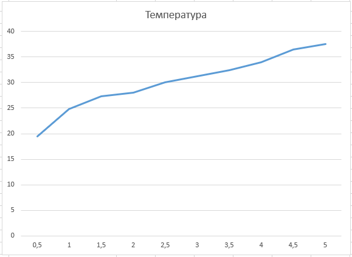
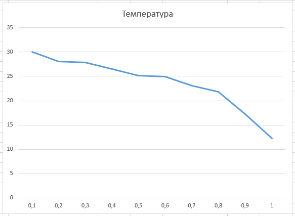
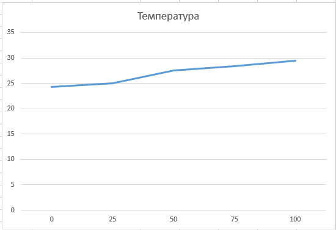

## Комп'ютерні системи імітаційного моделювання
## СПм-23-5, **Северін Ігор Сергійович **
### Лабораторна робота №**1**. Опис імітаційних моделей та проведення обчислювальних експериментів

### Варіант 2, модель у середовищі NetLogo:
[Climate Change](http://www.netlogoweb.org/launch#http://www.netlogoweb.org/assets/modelslib/Sample%20Models/Earth%20Science/Climate%20Change.nlogo)

### Опис моделі:
​	Ця модель ілюструє потоки енергії в Землі, зокрема теплової енергії. У центрі показано ядро планети рожевого кольору, а її поверхню зображено у вигляді зеленої смуги. Над цією смугою знаходиться блакитна атмосфера, а ще вище – чорний космос. В атмосфері можуть бути хмари та молекули вуглекислого газу (CO2), які є парниковими газами. Ці молекули блокують інфрачервоне випромінювання, що виходить від Землі. Хмари, у свою чергу, впливають на температуру планети, блокуючи або сонячні промені, що надходять, або випромінювання, яке залишає Землю.

### Керуючі параметри:
- Повзунок **ALBEDO** визначає, яку частку сонячної енергії, що досягає Землі, вона поглинає. При значенні 1,0 Земля відбиває все сонячне світло, що ілюструє ситуацію з білою поверхнею, наприклад, коли вся планета вкрита льодом. При значенні 0,0 Земля поглинає всю сонячну енергію, що позначено чорною поверхнею. Альбедо Землі зазвичай становить приблизно 0,6.
- Повзунок **SUN-BRIGHTNESS** регулює кількість сонячної енергії, що потрапляє в атмосферу Землі. Значення 1,0 відповідає яскравості нашого Сонця. Вищі значення дозволяють дослідити, що відбувалося б, якби Земля опинилася ближче до Сонця або якби Сонце стало яскравішим.
- Кнопки **add CO2** і **remove CO2** дозволяють додавати або прибирати молекули парникового газу CO2. Молекули CO2 блокують інфрачервоне випромінювання, але пропускають сонячне світло. Кнопки додають або видаляють молекули в кількостях від 25 до 150.
- За допомогою кнопок **add cloud** і **remove cloud** можна додавати або видаляти хмари. Вони блокують сонячне світло, але пропускають інфрачервоне випромінювання.

### Внутрішні параметри:
- **sky-top** - визначає положення верхнього рядка неба у моделі.
- **temperature** – відображає загальну температуру Землі в моделі, показуючи стан теплової енергії планети. Цей параметр визначається кількістю червоних точок у моделі.
- **earth-top** – встановлює позицію верхнього рядка земної поверхні, розмежовуючи атмосферу і поверхню Землі.
- **cloud-speed** - вказує швидкість переміщення хмар у атмосфері.
- **cloud-id** - унікальний ідентифікатор кожної хмари в моделі, що дозволяє відстежувати й управляти хмарами в системі.
### Додаткові відомості:
​	Global Temperature - графік глобальної температури на планеті за весь час симуляції. Температура землі пов'язана з кількістю тепла в землі. Чим більше червоних точок ви бачите, тим гарячіше.

​	Початкова температура Землі завжди фіксована на рівні 12 градусів, що створює стабільну основу для спостережень і досліджень. Молекулам CO2  "заборонено" виходити за межі синіх зон, що встановлює важливе обмеження на їхній рух. Це забезпечує їхнє перебування в атмосфері, де вони взаємодіють з іншими елементами моделі (CO2s - точна кількість молекул CO2 в атмосфері в даний момент).

### Недоліки моделі:
- Відсутність можливості встановити початкову кількість хмар є одним з обмежень. Поточна реалізація дозволяє додавати хмари лише по одній за допомогою кнопки, і на початку симуляції хмари повністю відсутні. Це може знизити реалістичність та динамічність моделі, хоча й забезпечує можливість додавання елементів у ході експерименту.

- Немає можливості задати початкову кількість молекул CO2. Як і у випадку з хмарами, молекули можна додавати тільки поодинці за допомогою відповідної кнопки, що обмежує можливість створення реалістичних початкових умов.

- Модель має спрощене уявлення про траєкторію сонячних променів, які завжди падають в одному напрямку. Це нехтує сезонними та географічними варіаціями, які впливають на кут падіння сонячних променів. У реальному світі ці зміни протягом дня та року мають значний вплив на розподіл тепла на Землі.

   

## Обчислювальні експерименти
### Експеримент 1 - Вплив сонячної енергії на температуру Землі.
Досліджується залежність температури планети протягом певної кількості тактів (2500) від  сонячної енергії.
Експерименти проводяться при 0.5-5.0 сонячної енегрії, з кроком 0.5, усього 10 симуляцій.  
Інші керуючі параметри мають значення за замовчуванням:

- **albedo**: 0.6
- **CO2 amount**: 0
- **cloud amount**: 0
<table>
<thead>
<tr><th>Номер симуляції</th><th>Сонячна енергія</th><th>Температура</th></tr>
</thead>
<tbody>
<tr><td>1</td><td>0,5</td><td>19,5</td></tr>
<tr><td>2</td><td>1,0</td><td>24,8</td></tr>
<tr><td>3</td><td>1,5</td><td>27,3</td></tr>
<tr><td>4</td><td>2,0</td><td>28,0</td></tr>
<tr><td>5</td><td>2,5</td><td>30,0</td></tr>
<tr><td>6</td><td>3,0</td><td>31,2</td></tr>
<tr><td>7</td><td>3,5</td><td>32,4</td></tr>
<tr><td>8</td><td>4,0</td><td>34,0</td></tr>
<tr><td>9</td><td>4,5</td><td>36,5</td></tr>
<tr><td>10</td><td>5,0</td><td>37,5</td></tr>
</tbody>
</table>

​	**Висновки з експерименту :** Графік чітко демонструє, що зі збільшенням яскравості Сонця температура Землі систематично зростає. Це наочно підтверджує значний вплив сонячної активності на кліматичні умови нашої планети, оскільки зміни в кількості сонячної енергії призводять до відповідного підвищення температури земної поверхні.

### Експеримент 2 - Вплив альбедо на температуру Землі.
Досліджується залежність температури протягом певної кількості тактів (2500) від рівня альбедо. 
Експерименти проводяться при 0.1-1.0 значеннях альбедо, з кроком 0.1, усього 10 симуляцій.  
Інші керуючі параметри мають значення за замовчуванням:

- **sun-brightness**: 1.0
- **CO2 amount**: 0
- **cloud amount**: 0
<table>
<thead>
<tr><th>Номер симуляції</th><th>Значення альбедо</th><th>Температура</th></tr>
</thead>
<tbody>
<tr><td>1</td><td>0,1</td><td>30</td></tr>
<tr><td>2</td><td>0,2</td><td>28,0</td></tr>
<tr><td>3</td><td>0,3</td><td>27,8</td></tr>
<tr><td>4</td><td>0,4</td><td>26,5</td></tr>
<tr><td>5</td><td>0,5</td><td>25,2</td></tr>
<tr><td>6</td><td>0,6</td><td>24,9</td></tr>
<tr><td>7</td><td>0,7</td><td>23,1</td></tr>
<tr><td>8</td><td>0,8</td><td>21,8</td></tr>
<tr><td>9</td><td>0,9</td><td>17,2</td></tr>
<tr><td>10</td><td>1,0</td><td>12,2</td></tr>
</tbody>
</table>

​	**Висновки з експерименту :** Графік наочно демонструє, що зі збільшенням значень альбедо температура Землі знижується. Це показує, що поверхня Землі, яка відбиває більше сонячної енергії, має тенденцію до охолодження, оскільки поглинається менше тепла від Сонця.

### Експеримент 3 - Вплив кількості CO2 на температуру Землі.
Досліджується залежність температури протягом певної кількості тактів (2500) від кількості CO2.
Експерименти проводяться при 0-100  значеннях CO2 в атмосфері, з кроком 25, усього 5 симуляцій.  
Інші керуючі параметри мають значення за замовчуванням:

- **sun-brightness**: 1.0
- **albedo**: 0.6
- **cloud amount**: 0
<table>
<thead>
<tr><th>Номер симуляції</th><th>Кількість CO2</th><th>Температура</th></tr>
</thead>
<tbody>
<tr><td>1</td><td>0</td><td>24,3</td></tr>
<tr><td>2</td><td>25</td><td>25,0</td></tr>
<tr><td>3</td><td>50</td><td>27,5</td></tr>
<tr><td>4</td><td>75</td><td>28,4</td></tr>
<tr><td>5</td><td>100</td><td>29,5</td></tr>
</tbody>
</table>

​	**Висновки з експерименту :** Графік чітко показує, що зростання кількості CO2 в атмосфері супроводжується підвищенням температури Землі. Збільшення концентрації CO2 посилює парниковий ефект, що призводить до підвищення температури на планеті.
