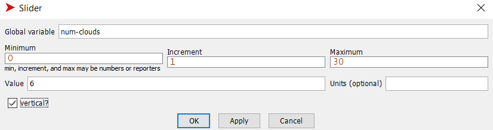
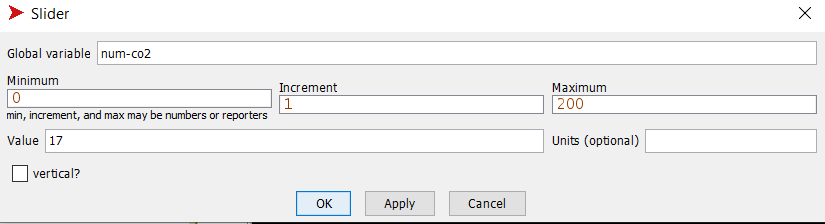
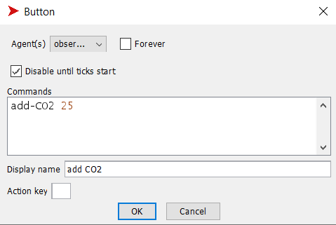
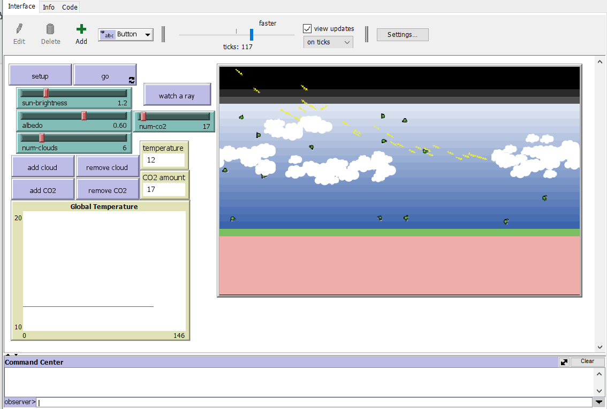
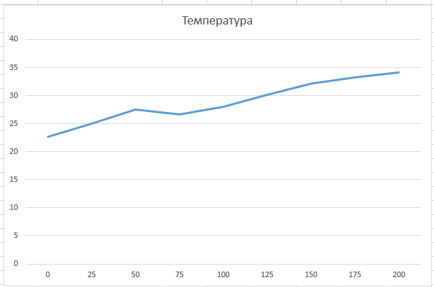

## Комп'ютерні системи імітаційного моделювання
## СПм-23-5, **Северін Ігор Сергійович **
### Лабораторна робота №**2**. Редагування імітаційних моделей у середовищі NetLogo

 

### Варіант 2, модель у середовищі NetLogo:
[Climate Change](http://www.netlogoweb.org/launch#http://www.netlogoweb.org/assets/modelslib/Sample%20Models/Earth%20Science/Climate%20Change.nlogo)

 

### Внесення змін у вихідну логіку моделі (за варіантом):

**1. Додання можливості вказівки початкової кількості хмар.** 

Для цього змінено процедуру **setup**. Наразі ця процедура створює потрібну кількість хмар в залежності від значення слайдера (через цикл **repeat**):
<pre>
  repeat num-clouds [add-cloud]
</pre>
**2. Додання зміни кута падіння нових сонячних промінів протягом часу**

Додано глобальну змінну **day-length** зі значення 900 тіків (довжина дня). Змінено процедуру **to create-sunshine** після чого угол падіння променів вимірюється від 110 до 260 градусів в залежності від кількості тіків з початку симуляції.

<pre>
  to create-sunshine
  ;; don't necessarily create a ray each tick
  ;; as brightness gets higher make more
  if 10 * sun-brightness > random 50 [
    create-rays 1 [
      let angle 110 + (ticks mod day-length / 6)
      set heading angle
      set color yellow
      ;; rays only come from a small area
      ;; near the top of the world
      setxy (random 10) + min-pxcor max-pycor
    ]
  ]
end
</pre>

### Внесення змін у вихідну логіку моделі (на власний розсуд):

**1. Додання можливість вказівки початкової кількості CO2.**

1.1 Для цього додаємо слайдер для вказівки початкової кількості CO2:

1.2 Вносимо зміни в процедуру **add-CO2**. Процедура **add-CO2** має приймати число, яке означає необхідну кількість створених молекул:

<pre>
  to add-CO2 [num]  ;; randomly adds 25 CO2 molecules to atmosphere
  let sky-height sky-top - earth-top
  create-CO2s num [
    set color green
    ;; pick a random position in the sky area
    setxy random-xcor
          earth-top + random-float sky-height
  ]
end
</pre>

1.3 У процедурі **setup** викликаємо створену процедуру **add-CO2**:

<pre> add-CO2 num-co2 </pre>

1.4 Наступним кроком є зміна роботу кнопки **add CO2**:

**2. Додання зміни дня та ночі.**

2.1 Кожні 900 тіків змінюється час доби: день переходить в ніч і навпаки. У цей момент колір неба змінюється на чорний, а Сонце припиняє випромінювати світло вночі. Також була додана глобальна змінна, яка визначає поточний час доби: день чи ніч.

<pre> day? </pre>

2.2 Після цього було створено процедуру, яка змінює колір неба на чорний:

<pre> 
to update-sky
  ifelse day?[
    ask patches [ 
      if pycor <= sky-top and pycor > earth-top [set pcolor scale-color blue pycor -20 20]
    ]
  ]
  [
    ask patches [ 
      if pycor <= sky-top and pycor > earth-top [set pcolor scale-color blue pycor -10 80]
    ]
  ]
end
</pre>
2.3 Процедуру **go** змінюємо. Тепер на початку визначається, чи зараз день чи ніч, і в залежності від цього змінюється змінна **day?** та встановлюється відповідний колір неба.

<pre>
  to go
  if (ticks + 1) mod 900 = 0 [
    set day? not day?
    update-sky
  ]
  ...
  end
</pre>
2.4 Змінюємо процедуру **run-sunshine**. Тепер промені створюються лише вдень:

<pre>
  to run-sunshine
  ...
   if day? [create-sunshine]  
  ...
  end
</pre>

Фінальний код моделі та її інтерфейс доступні за 
[посиланням](ClimateChange.nlogo)

 

## Обчислювальний експеримент
### Експеримент - Вплив кількості CO2 в атмосфері на температуру Землі.
Досліджується вплив кількості CO2 в атмосфері на температуру Землі протягом  8000 тіків.
Експерименти проводяться при 0-200  значеннях CO2 в атмосфері, з кроком 25, усього 9 симуляцій.  
Інші керуючі параметри мають значення за замовчуванням:

- **sun-brightness**: 1.0
- **albedo**: 0.6
- **num-clouds**: 0

<table>
<thead>
<tr><th>Номер симуляції</th><th>Кількість CO2</th><th>Температура</th></tr>
</thead>
<tbody>
<tr><td>1</td><td>0</td><td>22,7</td></tr>
<tr><td>2</td><td>25</td><td>25,0</td></tr>
<tr><td>3</td><td>50</td><td>27,5</td></tr>
<tr><td>4</td><td>75</td><td>26,6</td></tr>
<tr><td>5</td><td>100</td><td>28,0</td></tr>
<tr><td>6</td><td>125</td><td>30,0</td></tr>
<tr><td>7</td><td>150</td><td>32</td></tr>
<tr><td>8</td><td>175</td><td>33</td></tr>
<tr><td>9</td><td>200</td><td>34,1</td></tr>
</tbody>
</table>

​	**Висновки з експерименту :** Графік чітко показує, що зростання кількості CO2 в атмосфері призводить до підвищення температури, як і в попередньому подібному експерименті. Однак цього разу температура на близько 2 градуси нижча при тому ж рівні CO2. Ймовірно, це пов'язано зі зміною дня і ночі, оскільки вночі нові сонячні промені не надходять, і у планети є можливість охолонути.

