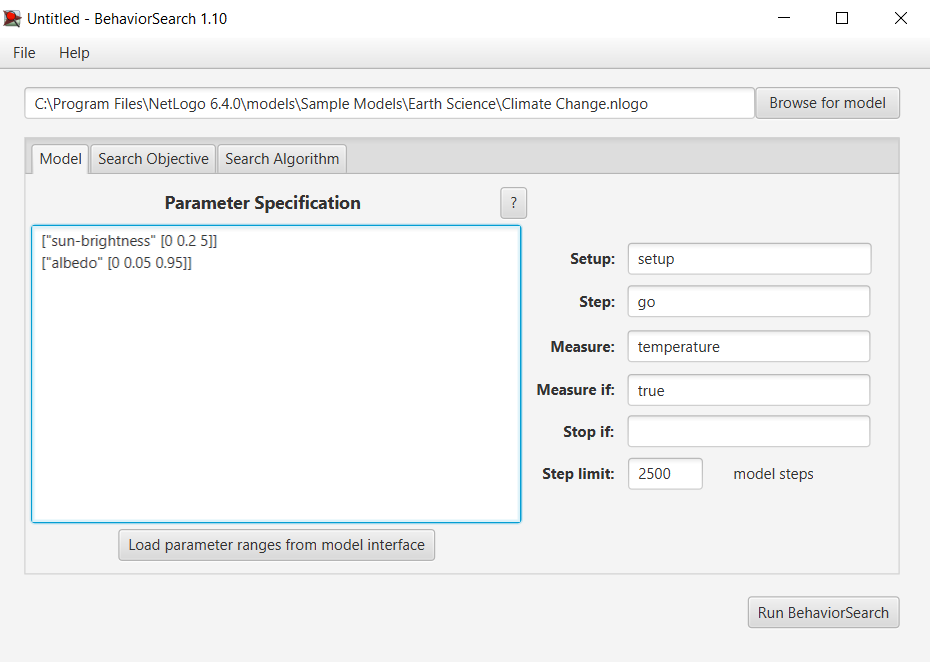
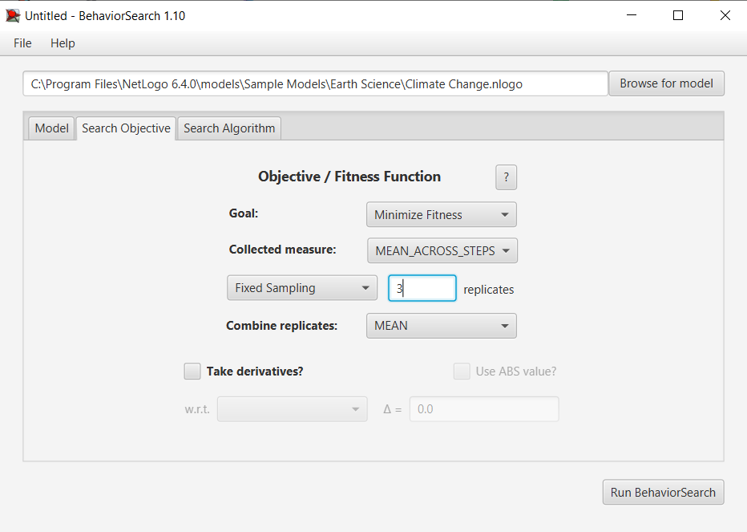
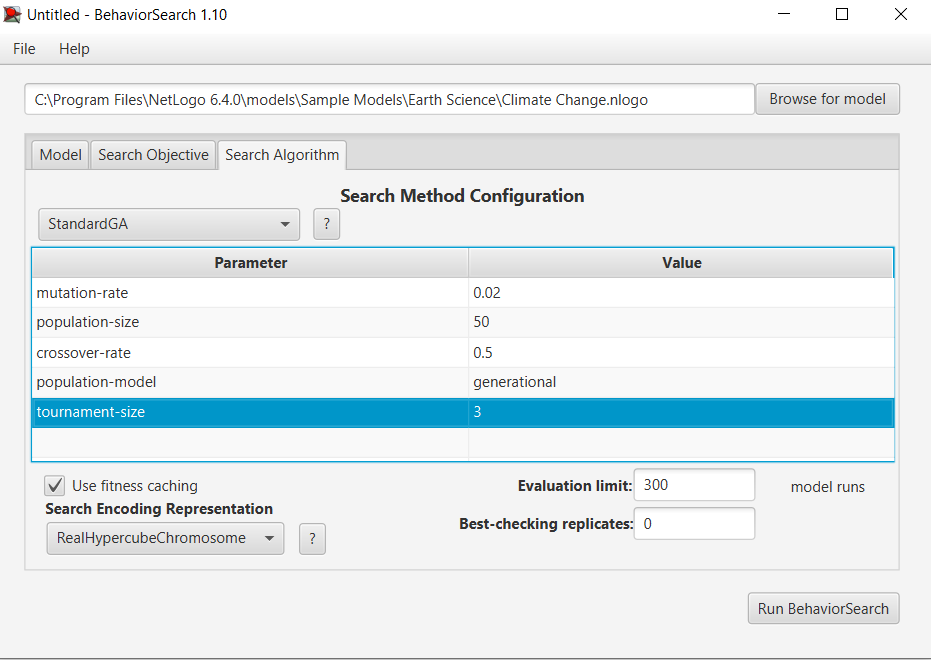
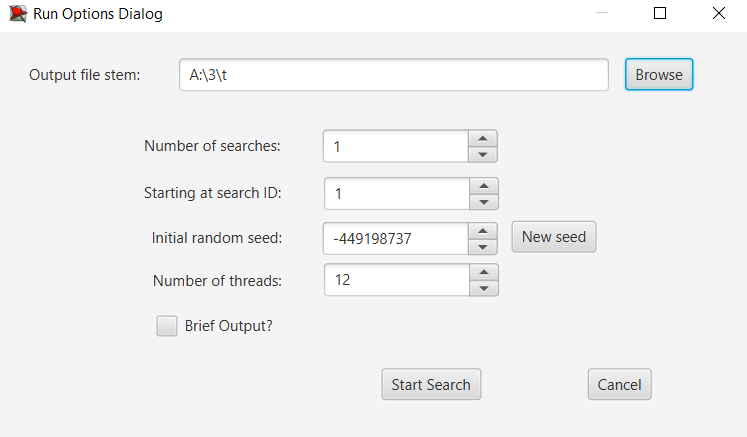
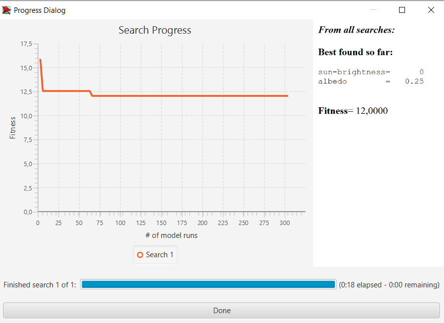
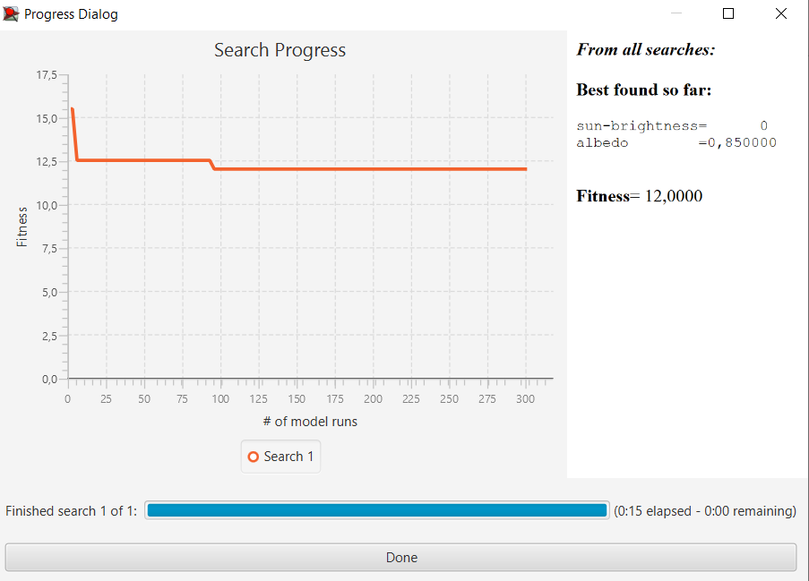

## Комп'ютерні системи імітаційного моделювання
## СПм-23-5, **Северін Ігор Сергійович**
### Лабораторна робота №**3**. Використання засобів обчислювального інтелекту для оптимізації імітаційних моделей

 

### Варіант 2, модель у середовищі NetLogo:
[Climate Change](http://www.netlogoweb.org/launch#http://www.netlogoweb.org/assets/modelslib/Sample%20Models/Earth%20Science/Climate%20Change.nlogo)
 

### Налаштування середовища BehaviorSearch:

**Обрана модель**:

​	Для даної лабораторної роботи була обрана модифікована модель з лабораторної роботи №1.

**Параметри моделі** :  

<pre>
  ["sun-brightness" [0 0.2 5]]
  ["albedo" [0 0.05 0.95]]
</pre>

​	Для фітнес-функції було обрано значення температури Землі, вираз для її розрахунку взято з коду моделі:

<pre>
  globals [
  	temperature  ;; overall temperature
	]
</pre>

​	Температура враховується в середньому за весь період симуляції тривалістю, 2500 тактів (адже на кожному такті є своє значення температури), починаючи з 0 такту симуляції.  Параметр зупинки за умовою **Stop if ** не використовувався. Загальний вигляд вкладки налаштувань параметрів моделі: 

**Налаштування цільової функції** :  

​	Налаштування відбуваються у вкладці Search Objective. Метою оптимізації параметрів імітаційної моделі, що описує рух енергії в Землі, є **мінімізація** температури, що визначається через параметр **Goal** зі значенням **Minimize Fitness**. Це означає, що необхідно знайти такі налаштування моделі, при яких температура досягатиме мінімального значення. Однак нас цікавить не температура в окремий момент часу, а її середнє значення за весь період симуляції. Для цього у параметрі **Collected measure**, який визначає спосіб обліку вибраного показника, вказано **MEAN_ACROSS_STEPS**.

​	Щоб уникнути спотворення результатів через випадкові варіації, які використовуються в лозіці самої імітаційної моделі, кожну симуляцію повторюють тричі , і результуюче значення обчислюється як середнє арифметичне.

**Налаштування алгоритму пошуку: **

​	Налаштування відбуваються у вкладці Search Algorithm.  Загальний вид вкладки налаштувань алгоритму пошуку: 

 

### Результати використання BehaviorSearch:
Діалогове вікно запуску пошуку 

Результат пошуку параметрів імітаційної моделі за допомогою **генетичного алгоритму**:

Результат пошуку параметрів імітаційної моделі за допомогою **випадкового пошуку**:

